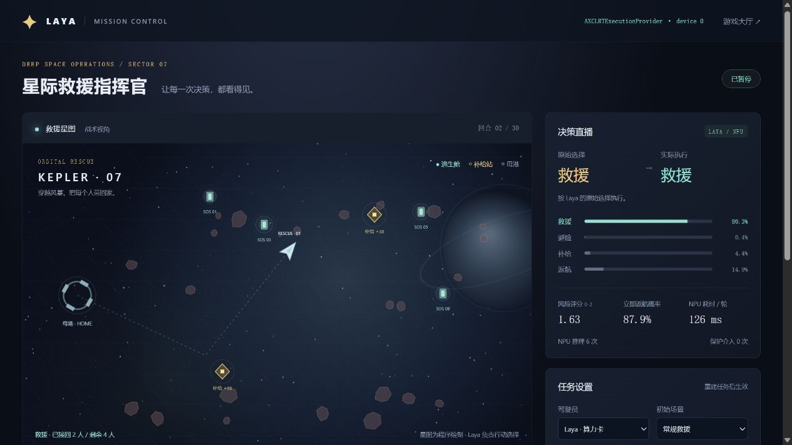

# Laya-AXERA

**在爱芯元智（AXERA）边缘 NPU 上运行的开源权重类型化决策模型。**

基于 [PyAXEngine](https://github.com/AXERA-TECH/pyaxengine) 推理
[AXERA-TECH/Laya](https://huggingface.co/AXERA-TECH/Laya) 的 AXModel checkpoint，
并提供决策台、贪吃蛇、Flappy Bird、俄罗斯方块、打方块和星际救援网页演示。

单张 AX8850（AXCL）上 multilingual checkpoint **约 31 ms/问题**，**0 个输出 token**。
不依赖 PyTorch / Transformers 运行时 / 云端 API —— 分词用 Hugging Face Rust tokenizer，
编码器全部在 NPU 上执行。

[English](README.md) ·
[模型包](https://huggingface.co/AXERA-TECH/Laya) ·
[上游 Laya](https://github.com/NandhaKishorM/laya) ·
[所适配的 MLX 移植版](https://github.com/mizorewww/laya-mlx)

Laya 是双向决策模型：对文本或结构化状态回答受约束的问题，单次前向完成，不生成文本。

- `choice`：在 2–4 个命名选项上给出概率分布。
- `score`：在 2–4 个有序等级上给出概率与期望分。
- `noul`：命题成立的概率 P(true)。

## 星际救援指挥官

新增太空救援场景：Laya 选择救援、避险、补给或返航，星图展示飞行、护盾、救援光束和航迹。
页面同步展示四项概率、风险评分、返航概率与 NPU 耗时，支持注入风暴、燃料泄漏以及一句话任务。
可切换固定规则和手动驾驶，在相同地图上对照观察。

[部署与实测效果](docs/rescue.zh-CN.md) · 启动服务后打开 `/rescue.html`



模型原始选择与保护规则介入分别显示。当前模型在部分场景会提前返航，具体实测结果和范围见部署指南。

## 支持平台

| 平台 | Provider | 说明 |
|---|---|---|
| AX8850 板端（片上） | `AxEngineExecutionProvider` | aarch64, NPU3 |
| x86/arm64 主机 + AXCL 卡（PCIe / M.2） | `AXCLRTExecutionProvider` | `device_id` 选卡 |

Provider 自动选择，也可通过 `provider=` 强制指定。

## 安装

```bash
git clone https://github.com/dshanpi/laya-axera.git
cd laya-axera
pip install -e '.[web]'
```

PyAXEngine 不在 PyPI 上，请先在设备/主机上安装
[pyaxengine releases](https://github.com/AXERA-TECH/pyaxengine/releases) 的 `axengine` wheel。
解析 ModernBERT / mmBERT 的 tokenizer 需要 `tokenizers>=0.21`
（Transformers 4.41 自带的版本过旧）。

下载模型包（三个 checkpoint，约 1.5 GiB）：

```bash
hf download AXERA-TECH/Laya --local-dir models/Laya
# 国内可用 hf-mirror.com 或 ModelScope
```

| Checkpoint | 骨干 | 单问题 NPU 延迟 | 推荐用途 |
|---|---|---:|---|
| `english/` | ModernBERT-large | 片上约 70 ms，AXCL 约 74 ms | 英文路由、护栏、工单分流 |
| `multilingual/` | mmBERT-base | 片上约 28 ms，AXCL 约 31 ms | 中文及多语言输入 |
| `typed-decisions/` | ModernBERT-large | 片上约 70 ms，AXCL 约 74 ms | 发票、安全、Agent 轨迹 |

延迟用 `python examples/bench.py <checkpoint>` 实测：片上为 AX8850 开发板
（multilingual 28.8 ms、english 71.1 ms，PyAXEngine，模型经 NFS 挂载），AXCL 为空闲
x86 主机卡。贪吃蛇每步问 3 个问题，单步耗时约为 3 倍单问题延迟。

## Python API

```python
import laya_axera as laya

agent = laya.load("models/Laya/multilingual")   # device_id=0，provider 自动选择
result = agent.predict(
    "发票4411重复扣款，请今天退还多扣的金额，否则我们会取消服务。",
    {
        "department": {
            "type": "choice",
            "instructions": "这条请求应由哪个团队处理？",
            "criteria": {"billing": "扣款与退款", "technical": "故障报错", "sales": "价格采购"},
        },
        "urgency": {
            "type": "score",
            "instructions": "这条请求有多紧急？",
            "criteria": ["常规", "尽快", "今天必须解决"],
        },
        "refund": {"type": "noul", "instructions": "用户是否明确要求退款？"},
    },
)
print(result["answers"]["department"]["choice"])        # billing
```

`system_one` 是 `predict` 的别名；`predict_request` 直接接受模型包的
`{"state": ..., "questions": ...}` 请求对象。输出 schema（choice / probabilities /
score / legend / noul / confidence / `action.act_probability`）与上游 Laya 及打包的
`axllm` 运行时一致，另附每个问题实测的 `npu_latency_ms`。

## 命令行

```bash
# 单个请求文件（与模型包 sample_request.json 同格式）
laya-axera run models/Laya/multilingual --input models/Laya/multilingual/sample_request.json

# 驻留 JSON Lines 模式：每行一个请求，/exit 退出
laya-axera run models/Laya/multilingual --device 1

# 网页演示：8010 端口，三个 checkpoint 首次使用时加载
laya-axera serve --root models/Laya --port 8010
```

## 网页演示

`laya-axera serve` 提供五个视图和一套 JSON 接口，共用同一份驻留 checkpoint：

- **决策台** —— 编辑 state 和 questions，提交到 NPU，以概率条形式查看答案与逐问题延迟；
  一键载入所选 checkpoint 的板端验证示例。
- **打方块** —— 规划器预测球在挡板行的落点，描述左移/右移/不动三个动作的后果，模型每步三选一，
  单问题约 30ms。探测显示三选一在各轮换下均正确（最佳项 0.62-0.78），实测 400 步与规划器 400/400 一致。
- **Flappy Bird** —— 每步一个二选一决策（拍翅/滑翔），单问题约 30ms：规划器描述两个动作的后果，模型选择，护栏只纠正致命提议。
- **俄罗斯方块** —— 启发式筛出 4 个候选落点，模型用 noul 对每个独立评分（统一模板中文陈述，
  探测表明该域下 choice 排序受标签偏置干扰），取 P(好落点) 最高者。每块 4 次推理约 126ms。
  另有手动模式：◀▶/A/B 亲自落子，模型为你的落点打分并展示它自己的首选，统计一致率。
- **贪吃蛇** —— laya-mlx 贪吃蛇演示的网页版。每一步向驻留 checkpoint 问三个问题
  （走向 / 风险 / 食物），确定性的循环安全护栏会纠正不安全的提议并统计每次干预。
  multilingual + 单张 AXCL AX8850 约 10 步/秒。

接口：`GET /api/info`、`GET /api/samples/{name}`、`POST /api/predict`、
`POST /api/snake/new`、`POST /api/snake/step`，以及 flappy / tetris / breakout 的
`new` 与 `step`（俄罗斯方块另有手动模式的 `POST /api/tetris/place`）。

每个游戏侧栏都有一排置灰的操作按钮，会随模型实际执行的动作点亮；游戏循环回放的是服务端
真实跑过的物理帧。

**决策台** —— 一条工单，四个类型化问题


**贪吃蛇** —— 每步三个问题


**Flappy Bird** —— 每步一个二选一决策


**俄罗斯方块** —— 四个候选落点独立评分


**打方块** —— 左移 / 右移 / 不动，每步一问


## 与板端验证输出的一致性

三个 checkpoint 均复现了模型包内 `axllm` 在 AX8850 板上录制的 `sample_output.json`：
选中标签完全一致，概率对齐到小数点后 4 位（如 multilingual：billing 1.0000、
urgency 1.9359、refund 0.9925、churn 0.9400）。

```bash
pytest tests/test_common.py                                   # 无需硬件
LAYA_AXERA_MODEL_DIR=models/Laya/multilingual pytest tests/   # 在 NPU 上
```

## 图约束

AXModel 为固定形状：batch 1、256 token、至多 4 个选项、每个问题一次 NPU 前向。
量化可能使概率发生偏移；在自动化高影响动作前，请用有代表性的数据校准阈值。

## 致谢与许可

Apache-2.0，见 [LICENSE](LICENSE) 与 [NOTICE](NOTICE)。提示构造、校准、输出 schema 与
贪吃蛇演示改编自 [laya-mlx](https://github.com/mizorewww/laya-mlx) 及上游
[Laya](https://github.com/NandhaKishorM/laya)（Convai Innovations）。AXModel、tokenizer
与 PyAXEngine 参考脚本来自 [AXERA-TECH/Laya](https://huggingface.co/AXERA-TECH/Laya)
部署包。模型权重需单独下载，不包含在本仓库中。
