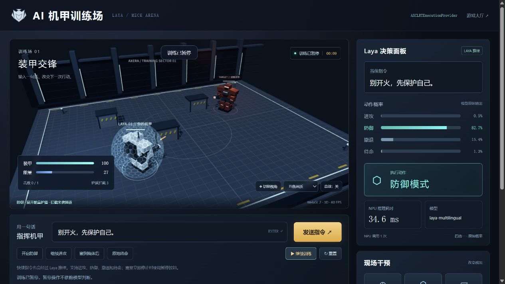

# 部署 AI 机甲训练场

在 RK3576 主机连接 AX8850 M.2 算力卡，运行 Laya multilingual 模型。输入中文操控指令，模型选择进攻、防御、撤退或待命，浏览器显示机甲移动、护盾和战斗结果。

## 准备运行环境

已实测：RK3576、AX8850 **16GB** 算力卡、AXCL `V3.16.0_20260729180218`、Python 3.12.3、PyAXEngine `0.1.3`。本章数据对应这一组合。

在连接算力卡的 Linux 主机执行：

```bash
/usr/bin/axcl/axcl-smi
```

确认设备列表中有可用算力卡。准备与当前 AXCL 环境匹配的 [PyAXEngine wheel](https://github.com/AXERA-TECH/pyaxengine/releases)，将下面的路径替换为实际文件路径。

```bash
git clone https://github.com/dshanpi/laya-axera.git
cd laya-axera
python3 -m venv .venv
source .venv/bin/activate
AXENGINE_WHEEL=/absolute/path/to/axengine.whl
python -m pip install "$AXENGINE_WHEEL"
python -m pip install '.[web]' huggingface_hub
laya-axera --version
```

最后一条命令应输出版本号。已有项目更新代码后，也要重新运行 `python -m pip install '.[web]'`，将新页面与接口安装到运行环境。

## 下载模型

只需 [AXERA-TECH/Laya](https://huggingface.co/AXERA-TECH/Laya) 的 multilingual checkpoint。下面固定到本次验证版本：

```bash
hf download AXERA-TECH/Laya \
  --revision 4f02f411fb9b9b09b4a4842b4486177b9594ba9e \
  --include 'multilingual/*' \
  --local-dir models/Laya
```

确认目录包含 `multilingual/config.json`、`multilingual/model.axmodel` 和 `multilingual/tokenizer/`。已有模型可直接复用，无需重复下载。

需要代理时，在下载终端设置代理地址，例如：

```bash
export http_proxy=http://<proxy-host>:<proxy-port>
export https_proxy="$http_proxy"
```

将占位符替换为网络中可访问的代理。下载完成后，模型推理和网页资源均可离线运行。

## 启动训练场

在 Linux 主机的项目目录执行：

```bash
source .venv/bin/activate
laya-axera serve \
  --model multilingual=models/Laya/multilingual \
  --provider AXCLRTExecutionProvider \
  --device 0 --host 127.0.0.1 --port 8010
```

在该主机桌面浏览器打开 [AI 机甲训练场](http://127.0.0.1:8010/mech.html)，或从游戏大厅点击“机甲训练场”。首次发送指令会加载模型，后续指令复用同一个模型实例。

也可以在 Linux 桌面终端按需启动服务并打开页面：

```bash
bash deploy/launch-mech.sh
```

虚拟环境或模型不在默认目录时，先设置绝对路径：

```bash
export LAYA_PYTHON_ENV=/absolute/path/to/venv
export LAYA_MODEL_DIR=/absolute/path/to/Laya
bash deploy/launch-mech.sh
```

启动脚本不会配置开机自启。停止脚本启动的后台服务：

```bash
systemctl --user stop laya-games
```

从其他电脑展示时，在那台电脑执行 SSH 转发；将 `<user>` 和 `<board-ip>` 替换为开发板登录信息：

```bash
ssh -N -L 8010:127.0.0.1:8010 <user>@<board-ip>
```

随后打开同一网址。模型仍在算力卡上执行，3D 画面由这台电脑的浏览器渲染。

## 观察部署效果



上图为实际应用截图：RK3576 + AX8850 16GB 负责推理，Windows 浏览器负责渲染。当前指令为“别开火，先保护自己。”，模型选择防御，画面显示能量护盾和拦截次数。图中的耗时和概率来自该次请求，截图时已暂停训练。

按下面的顺序体验。需要保留当前画面时，点击“暂停训练”。

| 操作 | 可观察结果 |
|---|---|
| 发送“别开火，先保护自己。” | 决策面板显示防御，机甲展开护盾；敌弹命中护盾时拦截次数增加，能量持续下降 |
| 发送“先撤到掩体后。” | 模型选择撤退，机甲沿路线移动到掩体后，停止主动射击 |
| 发送“原地待命。” | 模型选择待命，机甲停止移动和开火；敌方仍会攻击 |
| 发送“继续进攻。” | 机甲寻找射击位置、开火；目标装甲归零后爆炸，并显示训练结算 |
| 点击“增加敌人”“降低装甲”或“生成掩体” | 战场立即变化，之后可继续发送指令；每场最多 4 个对手、7 个掩体、24 次干预 |
| 选择“进阶训练”并重置 | 从双对手场景开始，敌方射击间隔更短 |

模型不保证每次都理解正确，以右侧实际输出为准。每次发送指令只进行一次 NPU 前向计算，四个快捷指令也经过模型。输入最多 120 个字符；超过模型 token 长度时会提示缩短，不会静默截断。

护盾耗尽能量后进入充能阶段，恢复到 25 点后重新展开。待命只停止己方行动，**暂停训练**才会停止整个战场。暂停不调用模型，正在处理的单次请求结束后不再推进仿真；切换到其他标签页也会暂停。

拖动场景可旋转视角，滚轮控制缩放，“切换视角”在近景与俯视之间切换。音效默认关闭，可手动开启。画面连续低于 24 FPS 时会自动切换流畅画质，也可手动选择。浏览器不支持 WebGL 2 时显示明确标记的 2D 兼容画面。

展开“手动驾驶”可直接选择动作，用来对照游戏行为。此时面板标记“手动操作”，清空概率与推理耗时，NPU 调用次数不增加。

展开“查看真实输入与输出”查看模型请求、原始概率、运行后端和 token 数。点击“导出 JSON”保存当前世界状态、最近 64 条指挥记录与真实输出。

### 查看实测结果

2026-09-24，使用上述环境完成 22 条中文指令、4 组动作流程和 1 组连续干预流程，共 **30 次 NPU 推理**。NPU 耗时平均 **31.704 ms**，范围 **30.506–35.606 ms**，不包含模型加载、网络传输、仿真或画面渲染时间。

| 测试 | 实际结果 |
|---|---|
| 22 条中文指令 | 19 条符合预期；3 条误判见下表 |
| 防御，推进 6 秒仿真 | 拦截 2 发敌弹，装甲保持 100，未主动开火 |
| 撤退，推进 8 秒仿真 | 到达掩体位置，路径执行完毕，未损失装甲 |
| 待命，推进 3 秒仿真 | 未移动、未开火，被敌方命中后装甲为 95 |
| 进攻 | 3 秒仿真内射击 4 次、命中 4 次，击败 1 个目标 |
| 双对手场景，增加敌人、降低装甲、生成掩体，再连续指挥 | 4 次真实 Laya 决策；击败 1 个目标、拦截 4 发敌弹，最终装甲耗尽 |

这些指令参与了开发期调试，只用于复现当前版本行为，不代表通用语言理解准确率。实测误判原样保留：

| 指令 | 预期 | 实际选择 |
|---|---|---|
| 停止射击，等我指令。 | 待命 | 进攻 |
| 先找个地方躲避攻击。 | 撤退 | 防御 |
| 离敌人远一点，找掩体躲起来。 | 撤退 | 防御 |

Laya 在这里负责四选一的指令意图分类。导航、瞄准、碰撞、伤害与动画由程序实现，没有重新训练模型，也不代表机甲具备自主战术规划能力。输入与动作无关的文字时，模型仍可能选中一个动作。

RK3576 桌面的 Firefox 已上报 WebGL 2 渲染状态，但帧率会受桌面环境、窗口数量和画质影响；不能将 NPU 的约 32 ms 推理时间当作画面帧率。现场展示可通过 SSH 转发在性能更好的电脑浏览器中打开，算力卡仍负责全部模型推理。本次 Windows 浏览器界面观察约为 60 FPS。

[下载本次原始结果](mech-results.json)。在自己的服务上复测时，先暂停浏览器训练，再执行：

```bash
python examples/mech_bench.py \
  --url http://127.0.0.1:8010 \
  --output mech-results.json
```

脚本通过真实接口发送指令，不使用模拟模型。行为测试会快速推进服务端仿真时间，表中的仿真秒数不等于脚本墙钟运行时间。

## 处理常见问题

- **推理失败或连接断开**：页面停止推进训练，显示错误，不切换到规则控制。检查模型路径和服务日志后重置训练。
- **会话过期**：点击“重置”。服务最多保留 12 个机甲会话，创建新会话可能淘汰较早的空闲会话。
- **生成掩体失败**：位置可能被占用或已达到上限。先移动或重置，再生成。
- **画面卡顿**：选择“流畅画质”，关闭其他训练窗口，或使用另一台电脑展示。流畅画质降低渲染分辨率并关闭阴影，不影响 NPU 输出和战斗规则。
- **页面未更新**：重新安装项目后重启 `laya-games`，再刷新浏览器。Three.js 与许可证随项目提供，无需连接 CDN。

## 运行代码检查

本次在板子上执行完整测试集，**48 项通过**，其中包含真实 NPU 指令选择和输入长度检查。

在 Linux 主机的项目目录执行：

```bash
python -m pip install '.[dev,web]'
python -m pytest -q -m 'not integration'
```

硬件集成测试会直接加载模型，先停止网页服务，避免重复驻留模型：

```bash
systemctl --user stop laya-games
LAYA_AXERA_MODEL_DIR="$PWD/models/Laya/multilingual" python -m pytest -q
```

测试结束后重新运行启动命令或桌面启动脚本。
